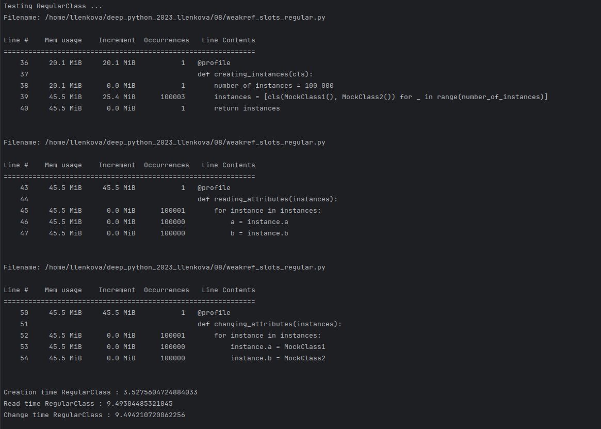
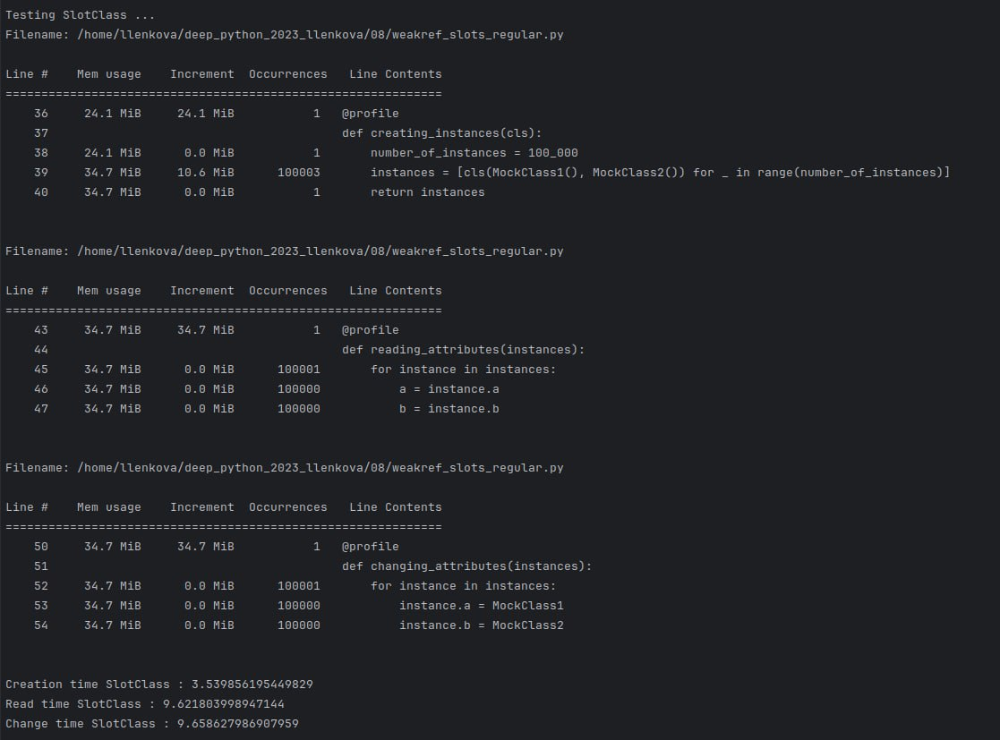

### RegularClass
- Создание экземпляров (Creation time): Процесс создания 100 000 экземпляров занимает примерно 3.53 секунды. 
- Чтение атрибутов (Read time): Чтение атрибутов у всех экземпляров занимает примерно 9.49 секунд.
- Изменение атрибутов (Change time): Изменение атрибутов всех экземпляров занимает около 9.49 секунд.
- Использование памяти: Пиковое потребление памяти составляет 25.4 Мб после создания экземпляров.

### SlotClass
- Создание экземпляров: Занимает около 3.54 секунды, что сопоставимо с RegularClass.
- Чтение атрибутов: Занимает примерно 9.62 секунды, что немного больше времени, чем у RegularClass.
- Изменение атрибутов: Процесс занимает около 9.66 секунд, что также немного дольше, чем у RegularClass.
- Использование памяти: Существенно меньше, чем у RegularClass, с уменьшением на 14.8 Мб. Это объясняется использованием слотов, которые оптимизируют хранение атрибутов.

### WeakRefClass
- Создание экземпляров: Процесс занимает примерно 3.78 секунды, что чуть дольше, чем у двух других классов.
- Чтение атрибутов: Занимает около 10.07 секунд, что является самым длительным временем среди трех классов.
- Изменение атрибутов: Самое длинное время изменения — около 10.07 секунд.
- Использование памяти: Пиковое потребление памяти составляет 26.5 Мб после создания экземпляров, что больше, чем у RegularClass.

### Общие выводы
- Использование памяти: SlotClass демонстрирует наибольшую эффективность по использованию памяти благодаря определению __slots__, что предотвращает создание словаря __dict__ для каждого экземпляра, значительно уменьшая объем используемой памяти. WeakRefClass потребляет больше памяти, чем RegularClass, что может быть неожиданным, учитывая использование слабых ссылок. Возможно, это связано с дополнительным накладным расходом на управление слабыми ссылками.
- Время создания: Времена создания экземпляров достаточно схожи, хотя SlotClass и WeakRefClass требуют незначительно больше времени по сравнению с RegularClass.
- Время чтения и изменения атрибутов: SlotClass и WeakRefClass показывают немного большее время на эти операции, что может быть связано с дополнительными механизмами доступа к атрибутам, в случае SlotClass через механизм слотов, а в случае WeakRefClass — через вызовы слабых ссылок.

### Конечный вывод
Выбор между этими классами должен быть сделан на основе требований конкретного приложения:
- Если цель — минимизировать использование памяти, SlotClass будет лучшим выбором.
- Если нет необходимости в экстремальной оптимизации памяти и повышенной скорости доступа к атрибутам, RegularClass является хорошим общим выбором.
- WeakRefClass может быть полезен, если объекты должны быть автоматически собраны сборщиком мусора, когда на них больше нет сильных ссылок, но это преимущество стоит дополнительного использования памяти и времени доступа.